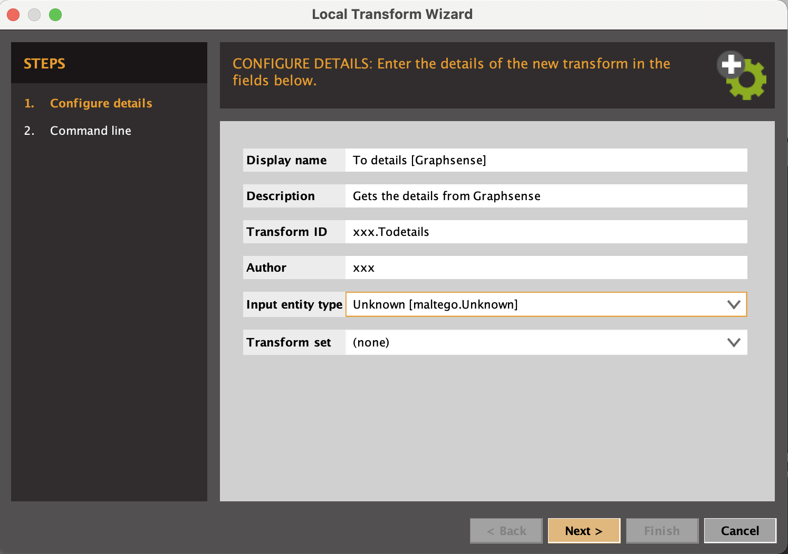
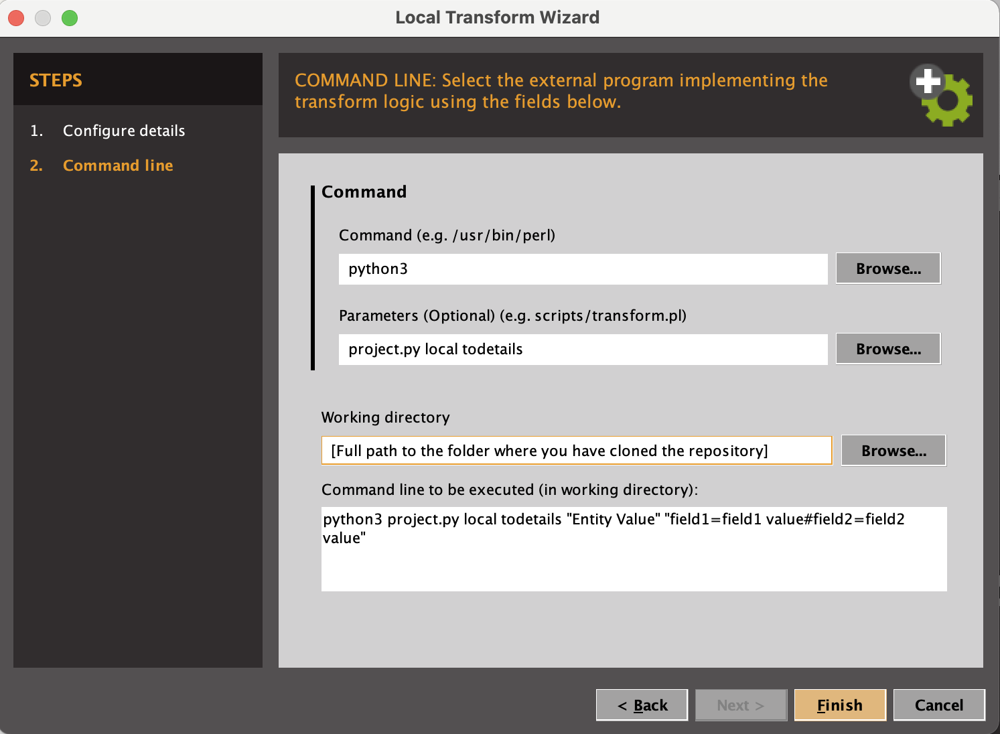

# GraphSense Maltego Transform
This tranform set for GraphSense is from an original idea of our Swiss colleagues and aims at querying GraphSense data directly in Maltego.  
The tranforms enable simple queries on GraphSense data and tag-packs to obtain transaction graphs and attribution tags in Maltego.  
|Graphsense and this transform set work for BTC, BCH, LTC, ZEC and ETH|  
|:---:|
||  
||  

## Authors and attribution
Vincent Graber  
[github/grarbervi](https://github.com/grabervi)  
Vincent Danjean  
[github/VinceICPO](https://github.com/vinceicpo)  
Images on this page are our own, and made from Maltego 4.2.19 Enterprise.  

## Disclaimer
This set of tools is provided as-is with no guaranty of accuracy.  
Check the facts before building your case on the finding from this tool.

## Prerequisite

Works with Python3  

Use the package manager [pip](https://pip.pypa.io/en/stable/) to install the below required python librairies.  

Microsoft Visual C++ 14.0 is required to install [maltego-trx](https://github.com/paterva/maltego-trx)  

```bash
pip3 install maltego-trx  
pip3 install requests
```
If you already have PIP and Maltego-TRX, make sure you have the latest releases by running something like:
```bash
/usr/local/opt/python@3.9/bin/python3.9 -m pip install --upgrade pip
pip3 install --upgrade maltego-trx
pip3 install --upgrade requests
```

The below was successfully tested with:
- pip-22.0.4
- maltego_trx-1.6.0
- requests-2.28.1

## Configuration

You need to provide your own token from the GraphSense API.  
Simply edit the *config.json* file to add your own API Token:  
- `"api_key": "*12345*",`  
- `"api_url": "https://api.graphsense.info"`  
Other GraphSense instances exist such as:  
- `"api_url": "https://api.ikna.io"`

## Installation of the required transforms inside Maltego

Clone this repository to a local folder on your machine.  

In Maltego, from the transform hub, install:
- the *Blockchain.info (Bitcoin) by Paterva* to work with Bitcoin Address Entities. 
- the *Tatum Blockchain Explorer by Maltego Technologies*, it adds support for other cryptocurrencies [(list here)](https://docs.tatum.io/supported-blockchains). The Tatum transforms run out of the box but you may consider getting your own free API key for more queries a month by registering at: [https://dashboard.tatum.io](https://dashboard.tatum.io)  

1/ In the *Transforms Tab* or in *Transforms manager*, add a *New Local Transform*.  

2/ Fill-in the required fields:  
In the *Display Name* box, enter:  
```To details [Graphsense]```  
In the *Transform ID* box, enter:  
```graphsense.ToDetails```, no space, no special characters here.  
In the *Author* box, enter whatever you like.  
In the *Input entity type* box, choose:  
```Unknown [maltego.Unknown]```, as you type, Maltego will propose the corresponding entries.

  
If all is good, your configuration should look similar to the above.  

Click on *Next>*  

3/ In the *Command line* box, provide the path to your python3 executable:  
- ```C:\Users\Unicorn\AppData\Local\Programs\Python\Python37\python.exe``` by default for Windows 10. Check on your own machine for the exact path.  
- ```python3``` by default for Mac OS X. (See "*Troubleshooting for Mac*"[^1] below if you experience problems).  

4/ In the *Command parameters* box, type:  
```project.py local todetails```
"totags" is one of the transforms available. Please see 6/ below.  

5/ In the *Working directory* box, insert the full path to the folder where you have cloned this project.  
  
If all is good, your configuration should look similar to the above.  

Click on *Finish*  

6/ You need to repeat 1/ to 5/ above for each of the transforms contained in this set:
- To Tags (project.py local totags)
- To Cluster (project.py local tocluster)

7/ Import the GraphSense Entities:  
For this, go to *Entities* tab, click on *Import Entities*  
Browse to and select the "Graphsense Entities.mtz" file. Click *Next>*  
Tick both the *Entities* and the *Icons* boxes to import everything. Click *Next>*  

Click on *Finish*

-- Done ! --

## Use

You can now use this set of transforms in a Maltego Graph starting from a supported cryptocurrency address or cluster.  
You may do this on any cryptocurrency address but this set of tranforms works for BTC, BCH, LTC, ZEC and ETH.  

As with any other Maltego Transform, all that is needed is a right-click on the entity and choosing the transform you want to run.  
  
  

The illustration above is a cluster in the Graphsense meaning. It is an item that ties together several cryptocurrency adresses that the GraphSense algorithms and euristics have found to be controlled by one same entity.  
If the cluster tags is accompanied by a businessman on the top left corner overlay,  -like in the illustration above-, this implies that the cluster or some of the cryptocurrencies within have been associated with attribution tags.
In a cluster shows a businessman, use the "to tags" transform to display the associated tag(s).  
The number on the left, below the businessman represents the number of cryptocurrency addresses belonging to that cluster.  


A normal way of using this to follow the money trail would be:
- Start by creating the entity you know of: drag and drop a cryptocurrency address from the entity palette.  
- Alternatively you may use the import function and use a csv file to create a batch of entities.  
- Right-click on the entity(ies) and run "to details" tranform. This will document the properties with all dates, amounts, etc.   
- if the entity now has a businessman overlay, right-click on the entity(ies) and run "to tags" transform to find out what the attribution tags is.  
To go further:  
- Right-click on the entity(ies) and run "to inbound (and/or outbound) transactions" from the Blockchain.info tranforms.  
- Right-click on the entity(ies) and run "to cluster" tranform. Again here if the resulting cluster shows a businessman overlay, run the "to tags" transform.  
- if nothing is found, run the "to Source address" or "to destination address" from Blockchain.info. Repeat the above process on these new addresses.  


## Contribute
You may help us develop this tool.  
The current local transform is possible thanks to the use of [paterva/maltego-trx](https://github.com/paterva/maltego-trx).  
It support a few entities but is very flexible in adding custom properties. Refer to the details of [supported entities](https://github.com/paterva/maltego-trx/blob/master/maltego_trx/entities.py).  
The results displayed are from queries to [GraphSense OpenAPI](https://github.com/graphsense/graphsense-openapi/blob/master/graphsense.yaml).  
Feel free to open an [Issue or improvement request](https://github.com/INTERPOL-Innovation-Centre/GraphSense-Maltego-transform/issues).  
The developement is done in the [Dev branch](https://github.com/INTERPOL-Innovation-Centre/GraphSense-Maltego-transform/tree/Dev).  


[^1]: *Troubleshooting for Mac*  
On Mac OS X it is important to check that the above pip is installing the modules in the same python3 as Maltego expects.  
To check which Python Maltego is effectively using, set the tranform with the `Command line` box as `which` and the `Command parameters` box as `python3`.  
Run the transform once and look for the result in the debug output box.  
This will give you the path to the python version used by the Maltego app.  
It needs to be the same path as the pip used above (check by runing ```pip -V``` in terminal).  
If it isn't, try with pip3 instead of pip. You may need to reinstall the Prerequisites above once this pip and python path is fixed.
